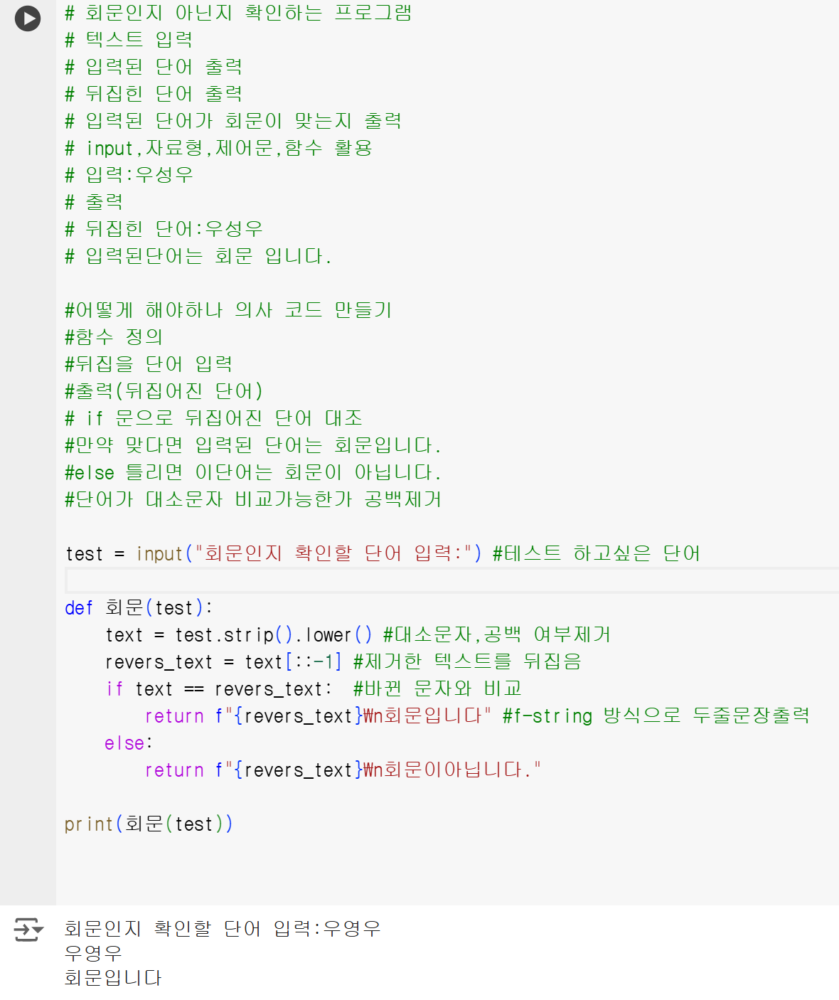
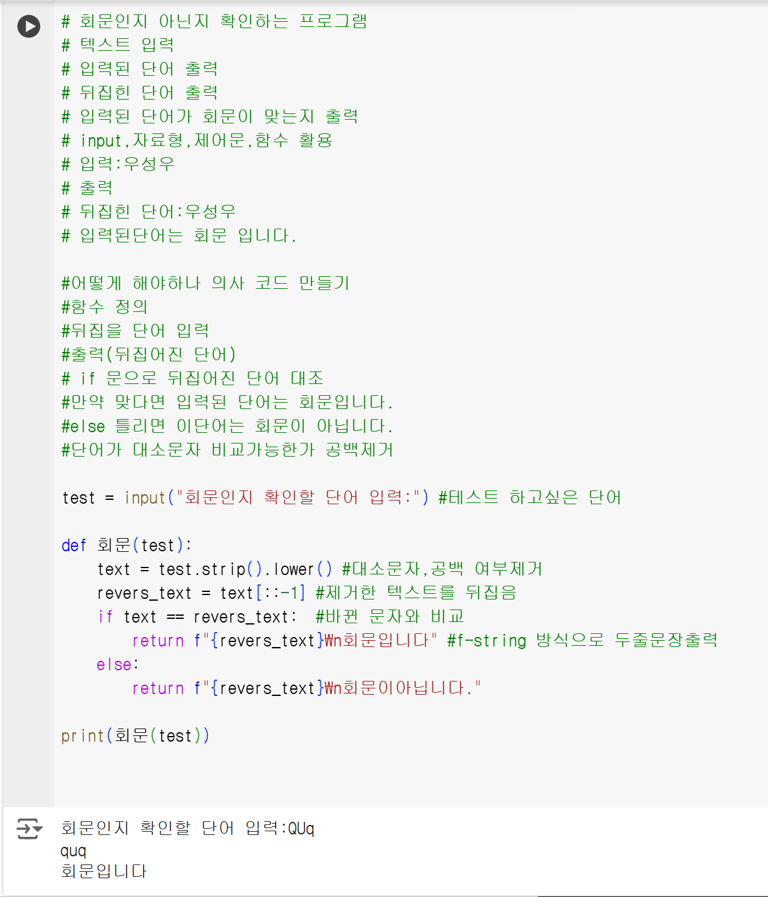

# AIFFEL Campus Online Code Peer Review Templete
- 코더 : 추현수
- 리뷰어 : 안승보

# PRT(Peer Review Template)
- [ ]  **1. 주어진 문제를 해결하는 완성된 코드가 제출되었나요?**
    - 문제에서 요구한 사항을 만족하는 프로그램을 작성하셨습니다.
    
    - 추가 test case인 'QUq'에서 소문자 변환 및 공백제거가 되는 부분이 있는데 체크해보시면 좋을 것 같습니다.
    
    - 또한, 출력 예시에 맞는 출력문이 작성되어야할 것 같습니다.

- [ ]  **2. 전체 코드에서 가장 핵심적이거나 가장 복잡하고 이해하기 어려운 부분에 작성된 
주석 또는 doc string을 보고 해당 코드가 잘 이해되었나요?**
    ```python
	revers_text = text[::-1]
    ```
    - 사용자에게 입력받는 텍스트를 뒤집어주는 핵심 코드라고 생각합니다.
        
- [ ]  **3. 에러가 난 부분을 디버깅하여 문제를 해결한 기록을 남겼거나
새로운 시도 또는 추가 실험을 수행해봤나요?**
    - 에러 혹은 디버깅 해보면 좋을 부분은 아래와 같습니다.
	    - 함수 code block의 indent 에러
	    - QUq => qUQ이 회문인가?
	    - QUq => quq로 출력하는 문제. 원본 데이터를 임의로 수정하는 게 올바른가?
	    - Q   Q => QQ로 출력하는 문제. 원본 데이터를 임의로 수정하는 게 올바른가?
        
- [ ]  **4. 회고를 잘 작성했나요?**
    - 프로그램을 작성하시면서 부족한 부분들은 팀원, 도구를 활용해서 시도하신 부분이 인상 깊었습니다.
        
- [ ]  **5. 코드가 간결하고 효율적인가요?**
    - 파이썬 스타일 가이드 (PEP8) 를 준수하였는지 확인
	    - PEP8 comment guide에 따라 inline comment를 작성하면 좋을 것 같습니다.
	    - 주석은 # 뒤에 공백 1칸을 작성해야합니다.
	    - 2줄 이상 작성하는 경우 doc string으로 작성해서 주석을 깔끔하게 작성하는 게 좋을 것 같습니다.
		- 모국어가 영어가 아닌 경우에도 왠만하면 영어로 작성하세요.

# 회고(참고 링크 및 코드 개선)
- https://peps.python.org/pep-0008/

# 리뷰어의 회고를 작성합니다.
- 퀘스트의 요구사항에 맞춰서 잘 작성하신 것 같습니다. 요구사항 외에 추가로 예외처리를 시도하신 부분이 있는데 시도 자체는 너무 좋았다고 생각합니다. 리뷰에서 나온 내용들을 참고하셔서 수정, 보완하시면 더 좋은 프로그램이 될 것 같습니다.